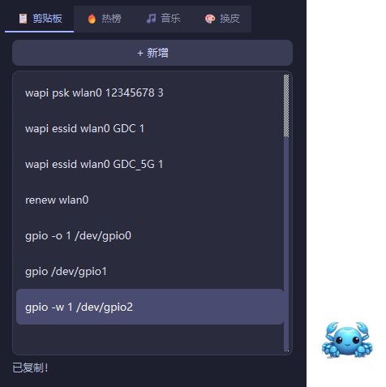
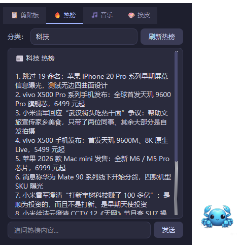
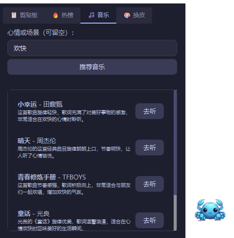
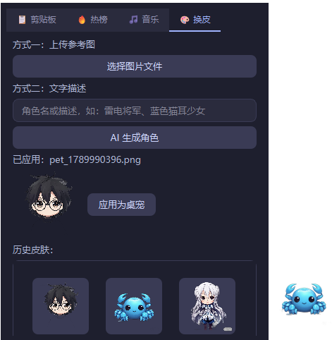

# 🐾 桌宠机器人

一个基于 Python + PyQt6 的 Windows 桌面宠物应用。点击桌面上的可爱角色即可弹出功能面板，集成了剪贴板管理、实时热榜、AI 音乐推荐和 AI 换皮四大功能，全部由智谱 AI 驱动。

## ✨ 功能特性

### 🐱 桌面宠物
- 无边框透明窗口，始终置顶，可自由拖动
- **三档大小**：右键菜单切换 小 / 中 / 大
- **托盘隐藏**：右键或托盘图标可隐藏到系统托盘，双击托盘图标恢复
- **自动定位**：功能面板会根据桌宠所在屏幕和位置自动选择弹出方向，避免超出屏幕
- 支持多显示器

### 📋 剪贴板管理
- 保存常用文本片段，一键复制
- 支持添加、编辑、删除
- 列表直接预览内容

### 🔥 热榜聚合
- 实时抓取 **微博热搜 / 百度热搜 / 科技（IT之家）/ 财经（新浪财经）**
- 下拉框切换分类
- 可就任意热榜内容向 AI 追问、讨论（流式回复）

### 🎵 音乐推荐
- 根据心情或场景描述，AI 推荐 3-5 首歌曲
- 每首附推荐理由
- 一键跳转 QQ 音乐搜索页试听

### 🎨 AI 换皮
- **文字生成**：输入角色名或外貌描述（如「雷电将军」「蓝色猫耳少女」），AI 生成专属桌宠形象
- **图片参考**：上传一张图片，AI 识别特征后生成风格化角色
- 使用智谱 CogView-3-flash 生成 + rembg 自动抠除背景（透明底）
- **历史皮肤**：每次生成的角色都会保存，可随时点击缩略图切回

## 📸 功能演示

| 📋 剪贴板 | 🔥 热榜 |
|:---:|:---:|
|  |  |
| **🎵 音乐推荐** | **🎨 AI 换皮** |
|  |  |

## 🛠️ 技术栈

| 组件 | 用途 |
|------|------|
| Python 3.10+ | 运行环境 |
| PyQt6 | 桌面 GUI |
| 智谱 AI (GLM-4-Flash) | 对话、总结、音乐推荐 |
| 智谱 AI (GLM-4V-Flash) | 图片识别 |
| 智谱 AI (CogView-3-Flash) | 文生图 |
| rembg + onnxruntime | 图像背景移除 |
| BeautifulSoup4 | 热榜页面解析 |

## 📦 安装与运行

### 1. 环境要求
- Windows 10 / 11
- Python 3.10 及以上

### 2. 克隆项目
```bash
git clone https://github.com/你的用户名/robot.git
cd robot
```

### 3. 安装依赖
```bash
pip install -r requirements.txt
```

> **关于抠图模型**：换皮功能依赖 `rembg`，它使用的轻量抠图模型（`u2netp`，约 4MB）会在**首次使用换皮功能时自动联网下载**，缓存到用户目录 `~/.u2net/`，无需手动安装。第一次生成会稍慢，之后即用本地缓存。

### 4. 运行
```bash
python main.py
```

首次启动会弹出配置窗口，填入你的**智谱 AI API Key**（从 [open.bigmodel.cn](https://open.bigmodel.cn) 免费获取）即可。

## 🖱️ 使用方法

| 操作 | 效果 |
|------|------|
| 左键点击桌宠 | 打开/关闭功能面板 |
| 左键拖动 | 移动桌宠位置 |
| 右键点击桌宠 | 打开菜单（调整大小 / 隐藏 / 退出）|
| 双击托盘图标 | 从托盘恢复显示 |

## 📁 项目结构

```
robot/
├── main.py              # 程序入口
├── config.py            # 配置管理（API Key、窗口位置、皮肤历史）
├── requirements.txt
├── build.bat            # PyInstaller 打包脚本
├── assets/              # 图片资源（默认桌宠图 + 生成的皮肤）
├── modules/             # 核心业务逻辑
│   ├── clipboard.py     # 剪贴板管理
│   ├── news.py          # 热榜抓取
│   ├── music.py         # 音乐推荐
│   └── skin.py          # AI 生图 + 抠图
├── services/
│   └── zhipu_client.py  # 智谱 AI 客户端封装
├── ui/                  # 界面
│   ├── pet_widget.py    # 桌宠窗口
│   ├── panel_widget.py  # 功能面板
│   ├── setup_dialog.py  # 首次配置窗口
│   ├── style.py         # 全局深色主题样式
│   └── tabs/            # 四个功能标签页
└── workers/
    └── async_worker.py  # 异步任务线程（避免界面卡顿）
```

## 📦 打包为 EXE

已提供打包脚本，先安装 PyInstaller：
```bash
pip install pyinstaller
```

执行打包：
```bash
build.bat
```

产物在 `dist/robot.exe`。分发时需将 `robot.exe` 与 `assets/` 文件夹放在一起：
```
robot/
├── robot.exe
└── assets/
    └── default_pet.png
```

> 打包不包含任何 API Key，每个用户首次运行需自行填写。抠图模型仍会在首次换皮时自动下载。

## ⚠️ 注意事项

- **API Key 安全**：你的 Key 存储在本地 `data/config.json`，该文件已被 `.gitignore` 排除，不会上传到 GitHub。
- **网络要求**：热榜抓取和 AI 功能都需要联网。若在受限网络（如公司内网）下热榜无法访问，属于目标网站被防火墙拦截，与本程序无关。
- **免费额度**：智谱的 GLM-4-Flash 和 CogView-3-Flash 均为免费模型，正常使用无需付费。

## 📄 License

MIT
